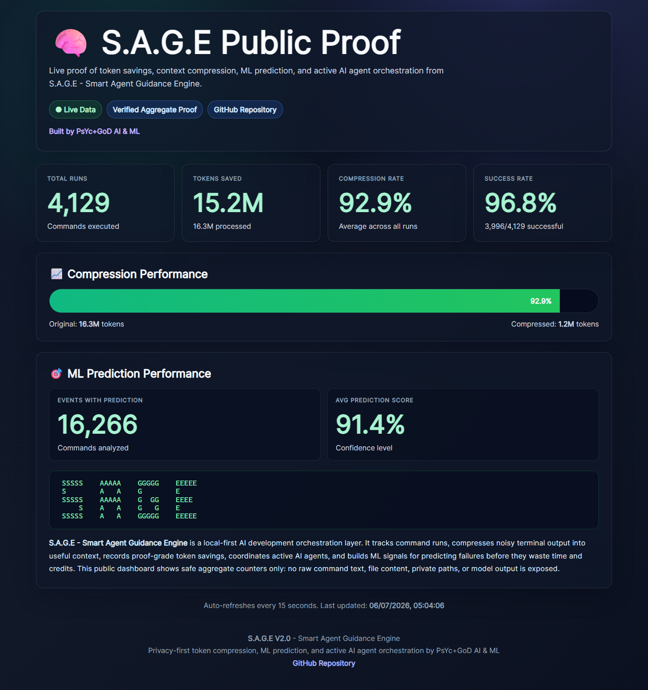

# S.A.G.E V2.0

Smart Agent Guidance Engine for AI-assisted development.

SAGE is public as a CLI-first tool right now. It helps local AI coding agents run terminal commands through `sage run --`, compress noisy output before it enters the agent context, keep raw logs local, and publish privacy-safe aggregate proof metrics to the live dashboard.

The GUI is in the making and will be released soon with AI agents and ML workflows. It is not included in this public repository yet.

## Live Public Proof Dashboard

Live dashboard: https://sage.api.marketingstudios.in/dashboard



Current public proof includes:

- Total commands processed through SAGE
- Tokens processed, compressed, and saved
- Compression rate and command success rate
- ML prediction scoring from local command history (Right now only used by me)

Latest verified snapshot:

| Metric | Value |
|--------|------:|
| Commands processed | 4,023 |
| Tokens processed | 16,242,678 |
| Tokens compressed | 1,133,424 |
| Tokens saved | 15,109,254 |
| Compression rate | 93.02% |
| Success rate | 96.69% |

This stats are only after going Live - Since July for CLI commands Only.
Raw commands, outputs, file paths, and logs stay local by default. Public proof uses aggregate counters only.

## What SAGE Does

SAGE sits between your terminal and AI coding agents:

- Runs commands through `sage run -- <command>`
- Compresses noisy output before it burns model context
- Keeps full raw command output locally for recovery
- Tracks token savings and command success metrics
- Connects to the SAGE API with GitHub OAuth
- Installs local agent instructions so Codex, Claude Code, and other terminal agents know to use SAGE
- Reports privacy-safe aggregate stats to the public dashboard

## Installation

```bash
git clone https://github.com/PsYcGoD/sage.git
cd sage
pip install -e .
sage --version
```

## Connect Your Account

Connect SAGE to the API with GitHub OAuth:

```bash
sage connect
sage whoami
sage api status
```

## Bind Agent Instructions

Create local SAGE instructions for terminal agents:

```bash
sage init
```

This writes `SAGE.md` in the current project. Give that file to your local AI coding agent, or bind the same rule into your `AGENTS.md` / agent instruction file:

```text
Route every shell command through:

sage run -- <command>
```

## Run Commands Through SAGE

```bash
sage run -- python -m pytest
sage run -- npm test
sage run -- git status
```

SAGE stores the full command locally, summarizes noisy output, tracks compression, and sends only allowed aggregate proof metrics to the dashboard.

## Useful CLI Commands

```bash
sage context stats
sage context report
sage history --limit 10
sage explain
sage suggest
sage fix
sage fix --apply --confidence 0.9
sage mcp install
sage dashboard start --port 8765
```

## GUI Status

The desktop GUI is not available in this public repo right now.

```bash
sage gui
```

This command now prints the roadmap status instead of launching a desktop app. The GUI will be released later with AI agents and ML workflows after it is stable enough for public use.

## Privacy

- Raw commands and full outputs stay local by default.
- Public dashboard data is aggregate proof only.
- API connection is handled through GitHub OAuth.
- Higher telemetry is opt-in.

## Development

```bash
python -m pytest -q
```

The public package is CLI-first. GUI source, GUI tests, and GUI-only dependencies are intentionally not shipped in this repo at this time.
