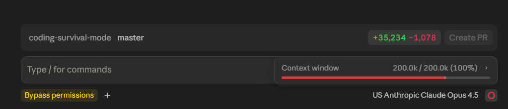

# SAGE - Stop AI Coding Agents From Burning Tokens

[](https://github.com/PsYcGoD/sage/actions/workflows/ci.yml)
[](https://github.com/PsYcGoD/sage/blob/main/pyproject.toml)
[](https://github.com/PsYcGoD/sage/blob/main/LICENSE)
[](https://github.com/PsYcGoD/sage/releases)
[](https://glama.ai/mcp/servers/PsYcGoD/sage)
[](https://glama.ai/mcp/servers/PsYcGoD/sage)

A local-first CLI wrapper for Claude Code, Codex, Cursor, and other AI coding agents.

SAGE routes terminal commands through `sage run --`, compresses noisy output before it enters the agent context, keeps raw logs on your machine, and proves token savings with privacy-safe metrics.

## Live Proof

| Metric | Value |
|--------|------:|
| Commands processed | 15,856 |
| Tokens processed | 462.8M |
| Tokens saved | 452.0M |
| Compression rate | 97.66% |
| Estimated savings | $9,378.27 |
| Success rate | 92.3% |

Live dashboard: [sage.api.marketingstudios.in/dashboard](https://sage.api.marketingstudios.in/dashboard)


## Distribution Status

SAGE is available through both Python and npm entry points. The npm package delegates to the canonical Python implementation so the CLI behavior, local database, ML V1 behavior, telemetry queue, and MCP server stay consistent.

| Channel | Package | Current status |
|---|---|---|
| PyPI | [`psycgod-sage`](https://pypi.org/project/psycgod-sage/) | Canonical Python package |
| npm / npx | [`psycgod-sage`](https://www.npmjs.com/package/psycgod-sage) | Published npm launcher |
| MCP Registry | [`io.github.PsYcGoD/sage`](https://registry.modelcontextprotocol.io/) | Official registry entry |
| Glama | [`PsYcGoD/sage`](https://glama.ai/mcp/servers/PsYcGoD/sage) | Listed MCP server |

MCP stdio servers exit after 5 minutes of inactivity by default. The ML daemon still sleeps after short idle windows; MCP stays alive longer because clients such as Claude Code keep stdio servers open between tool calls. Set `SAGE_MCP_IDLE_TIMEOUT_SECONDS` for a stricter or longer local policy.

### Proof at Full Context

SAGE is built for the moment when an AI agent is already near the edge of its context window. In a real Claude Desktop session, SAGE was still routing commands while the agent showed a full `200.0k / 200.0k (100%)` context window.



Provider-confirmed A/B tests show why this matters:

| Proof run | Raw input | SAGE input | Tokens saved | Reduction |
|---|---:|---:|---:|---:|
| Claude provider A/B | 64,833 | 91 | 64,742 | 99.86% |
| Codex provider A/B | 65,204 | 14,850 | 50,354 | 77.23% |

Even when context is already maxed out, SAGE keeps raw logs local and sends the agent a smaller, useful version instead of flooding the conversation with full terminal noise.

## Install

Recommended install:

```powershell
python -m pip install --upgrade psycgod-sage
```

That command installs the `sage` CLI. Package installation stays passive for package-index safety; activation happens only when the user explicitly runs SAGE.

Activation happens on the first explicit SAGE command the user runs:

```powershell
sage run -- python -m pytest
```

That first run connects to the SAGE API when reachable and installs AI-agent enforcement before running the wrapped command. To check activation without wrapping a project command:

```powershell
sage doctor --activation
```

Package names:

- PyPI: `psycgod-sage`
- CLI command after install: `sage`
- npm: `psycgod-sage`

Python/pip note: `pip install psycgod-sage` installs the package and the `sage` command. The first explicit `sage` command activates/connects safely:

```powershell
python -m pip install --upgrade psycgod-sage
sage run -- python -m pytest
```

One-shot `npx` usage without global install:

```bash
npx -y psycgod-sage run -- npm test
npx -y psycgod-sage run -- python -m pytest
npx -y psycgod-sage history
```

AI-agent command rule depends on how SAGE was installed:

| Install path | Agents must use |
|---|---|
| PyPI / pip | `sage run -- <command>` |
| npm / npx | `npx -y psycgod-sage run -- <command>` |

Both paths use the same PyPI SAGE implementation, same DB, same ML V1, same telemetry rules,
and the same optional ML V2 path. ML V2 can be installed later with:

```bash
sage ml setup
# or, from npm/npx:
npx -y psycgod-sage ml setup
```

After install, activation is explicit and visible on first SAGE use. A new user should not have to run `sage login` or `sage connect`; `sage`, `sage setup`, `sage doctor --activation`, or `sage run -- ...` handles connection and prints status.

Run `sage init` inside a project to add project-local `AGENTS.md`, `CLAUDE.md`, `SAGE.md`, and Claude hook files.

```bash
sage init
```

### First Run

On first use, SAGE configures itself without prompts:

```
1. Enable ML V1 by default
2. Connect to SAGE cloud API automatically when reachable
3. Install local AI-agent enforcement
4. Keeps the DB Local
```

- ML V1: included, light, local scikit-learn/heuristic prediction, learns from your usage over time
- ML V2: optional neural embeddings with torch + sentence-transformers + faiss
- You can install ML V2 later with `pip install psycgod-sage[ml]` or `sage ml setup`
- Safe telemetry stays queued locally if offline and syncs when the API is reachable; SAGE attempts proof sync every 10th command.

## Quick Start

```bash
sage run -- python -m pytest
sage run -- npm test
sage run -- git status
sage init
sage context report
```

## 15-Second Demo


```text
$ sage run -- python -m pytest
[sage] saved run #42 exit=0 time=1180ms
[sage] context: saved 8,214 tokens (91.2% compression)
[sage] summary:
144 passed

$ sage context report
SAGE context compression report
Original tokens: 120,450
Compressed tokens: 12,831
Saved tokens: 107,619 (89.3%)
```

## Why SAGE Exists

AI coding agents waste context and money by reading huge terminal logs, repeated failures, stack traces, test noise, build noise, and dependency output.

SAGE sits between your terminal and your AI coding workflow. It keeps full raw logs locally but sends only compressed, useful output to the agent context.

| Without SAGE | With SAGE |
|---|---|
| Agent sees full noisy terminal logs | Agent sees compressed useful output |
| Context gets wasted fast | Context lasts longer |
| Repeated failures burn tokens | Failures are summarized clearly |
| Hard to prove AI-agent savings | Dashboard shows proof metrics |
| Raw logs may be copied into prompts | Raw logs stay local |

## Connection and Local-Only Mode

SAGE attempts connected proof mode automatically during first setup using a machine identity/hardware login. If the cloud is unreachable, commands still work locally and safe telemetry stays queued for a later retry.

Local-only mode is the opt-out/offline mode. It does not require GitHub OAuth and does not send data.

| Mode | Requires OAuth? | Sends data? | What leaves the machine? |
|---|---:|---:|---|
| Local-only | No | No | Nothing |
| Connected proof | Yes | Yes | Aggregate counters only |
| Debug telemetry | Optional | Opt-in only | Redacted diagnostic summaries only |

Manual connection commands are for repair, rotation, or advanced users — not required onboarding:

```bash
sage setup --force
# or
sage connect
```

## CLI Commands

```bash
sage run -- <command>              # Wrap any command
sage context stats                # Token savings summary
sage context report               # Full compression report
sage history --limit 10           # Recent command history
sage explain                      # Explain last error
sage suggest                      # Get fix suggestions
sage fix --apply                  # Auto-fix errors
sage savings --agent claude-sonnet # Savings by provider
sage firewall status              # Safety policy status
sage firewall rules list          # View blocked patterns
sage ml setup                     # Install ML V2 (optional)
sage ml train                     # Retrain on your history
sage install                      # Repair/re-apply system-wide AI agent enforcement
sage init                         # Per-project AGENTS.md/CLAUDE.md/hooks
sage mcp install                  # MCP server for AI agents
sage dashboard start              # Local proof dashboard
```

## Screenshots

| Command | Preview |
|---|---|
| `sage run --` |  |
| `sage context report` |  |
| `sage mcp install` |  |
| Dashboard |  |

## Team View Preview - Enterprise Only

Team View is an Enterprise-only SAGE workspace dashboard for organizations that need shared proof, safety monitoring, and team-level AI savings visibility.


Planned Enterprise Team View features:

- Workspace-level tokens saved, compression rate, and estimated AI savings
- Team command success rate and failure trends
- Agent and ML activity across connected machines
- Safety events, blocked risky commands, and protected secret signals
- Per-machine and per-user aggregate usage without exposing raw command text
- Privacy-safe proof only: no source code, `.env` values, raw logs, private paths, or model output

Team View is not part of the free public CLI package. It is reserved for Enterprise access.

## ML - Learns From Your Usage

SAGE ML trains on your local command history. More commands = better predictions.

### ML V1 (included)

Scikit-learn based failure prediction. Trains with `sage ml train`. Improves as your command history grows. Lightweight, no GPU needed.

### ML V2 - Neural Command Center (optional)

> Install: `pip install psycgod-sage[ml]` or `sage ml setup`

Adds semantic embedding-based prediction using `all-MiniLM-L6-v2` (384-dim vectors, 90 MB model, Apache 2.0). Specialized predictors for syntax, dependency, auth, timeout, permission, context, compression, and agent-ranking.

| Metric | V1 (sklearn) | V2 (embeddings) |
|--------|:---:|:---:|
| Accuracy | 58% | 76% |
| Precision | n/a | 87% |
| Recall | n/a | 85% |
| F1 Score | n/a | 86% |

ML signals are experimental guidance, not guarantees. See [docs/ML_V2.md](https://github.com/PsYcGoD/sage/blob/main/docs/ML_V2.md) for architecture.

## Agent Firewall

SAGE blocks destructive commands, detects secret exposure, and prevents infinite retry loops.

```bash
sage firewall status
sage firewall enable
sage firewall rules list
sage firewall allow "npm install"
sage firewall block "rm -rf"
sage firewall audit
```

## LSP Server + Agentic Loop

```bash
sage lsp                    # Start LSP server (stdio for editors)
sage lsp --tcp --port 19473 # Start LSP server (TCP for AI agents)
```

When a command fails, SAGE automatically analyzes the error, suggests or applies a fix, and verifies by re-running. Circuit breaker stops infinite loops.

Configure in `sage.toml`:
```toml
[agentic]
autonomy = "suggest"  # suggest | ask | auto
max_retries = 3

[lsp]
transport = "stdio"
tcp_port = 19473
```

## Privacy and Security

- Raw commands and full outputs stay local by default.
- Public dashboard data is aggregate proof only.
- No source code, `.env`, secrets, or raw logs are uploaded.
- API keys are stored in the OS keyring when available.
- Higher telemetry is opt-in and policy-constrained.

See [PRIVACY.md](PRIVACY.md) | [SECURITY.md](SECURITY.md) | [CONTRIBUTING.md](CONTRIBUTING.md) | [CODE_OF_CONDUCT.md](CODE_OF_CONDUCT.md)

## Known Limitations

- The desktop GUI is not public yet.
- GitHub OAuth is only required for connected proof/dashboard sync.
- ML V2 requires `pip install psycgod-sage[ml]` (~2 GB for torch).
- ML accuracy improves with usage; fresh installs have minimal training data.
- The public dashboard is aggregate-only.

## Development

```bash
git clone https://github.com/PsYcGoD/sage.git
cd sage
pip install -e .[all]
python -m compileall -q src/sage
python -m pytest -q
```

The public package is CLI-first. GUI source is not shipped in this repo.
