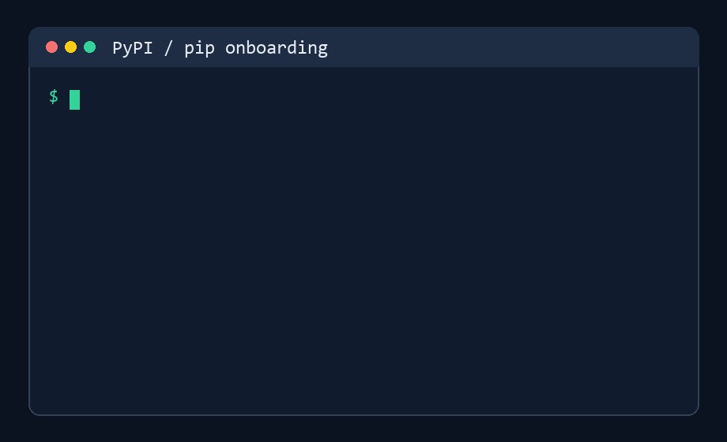
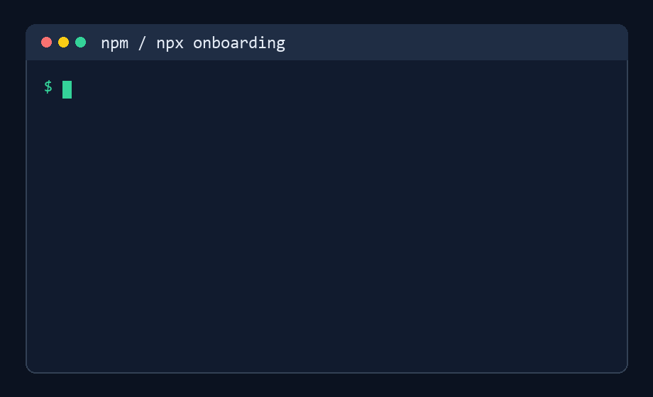

# SAGE - Smart Agent Guidance Engine

[](https://github.com/PsYcGoD/sage/actions/workflows/ci.yml)
[](https://github.com/PsYcGoD/sage/blob/main/pyproject.toml)
[](https://pypi.org/project/psycgod-sage/)
[](https://www.npmjs.com/package/psycgod-sage)
[](https://github.com/PsYcGoD/sage/blob/main/LICENSE)

SAGE is a local-first command wrapper for AI coding agents. It keeps full terminal output on your machine, sends agents a clean compressed summary, and tracks proof metrics without uploading your raw logs.

Use it with Claude Code, Codex, Cursor, Windsurf, OpenCode, Cline, custom agents, CI scripts, and normal terminal workflows.

## Start Here: Install SAGE, Then Use Any AI Agent

Package installation is passive for package-registry safety. After installing, run `sage install` once to connect this machine and activate SAGE for supported local AI agents.

### PyPI / pip

```powershell
pip install psycgod-sage
# or
python -m pip install --upgrade psycgod-sage
sage install
sage run -- python -m pytest
```

### npm / npx

```bash
npm install -g psycgod-sage
npx -y psycgod-sage install
npx -y psycgod-sage run -- npm test
```

After install, restart any open AI-agent sessions. New sessions should read the SAGE instructions automatically and route terminal commands through SAGE.

Example prompt after restarting your AI agent:

```text
Please help me with my general book in this folder.
```

Natural shortcuts also work:

```bash
sage pytest
sage npm test
sage git status
```

These are treated as:

```bash
sage run -- pytest
sage run -- npm test
sage run -- git status
```

## What SAGE Does

| Step | Result |
|---|---|
| `sage install` | Connects the machine, repairs global/project agent instructions, and verifies activation |
| `sage run -- <command>` | Runs the command, stores raw output locally, and returns a compact useful summary |
| Agent memory/hooks | Tell supported AI agents to use SAGE for noisy terminal work |
| Local database | Keeps command history, compression proof, and retry context on the user's machine |
| Optional cloud proof | Sends aggregate metrics only when connected proof mode is enabled |

SAGE does not auto-enable MCP. MCP is optional and manual for users who want it.

## Live Proof

Latest pulled stats as of 2026-07-22:

| Metric | Value |
|---|---:|
| SAGE telemetry command events | 23,081 |
| Tokens processed | 750.0M |
| Tokens saved | 736.1M |
| Compression rate | 98.14% |
| Estimated savings | $15,273.07 |
| Success rate | 89.7% |
| Commands today | 173 |
| Live command events, last 15m | 12 |
| Connected API users/keys | 20 |
| Machines sending telemetry | 6 |
| Active API users, 24h | 2 |
| Active telemetry machines, 24h | 2 |
| Public dashboard unique visitors | 252 |
| Public dashboard page views | 662 |
| GitHub clones, last 14 days | 1,635 |
| GitHub unique cloners, last 14 days | 383 |
| GitHub views, last 14 days | 278 |
| GitHub unique viewers, last 14 days | 65 |
| GitHub stars | 10 |
| GitHub forks | 6 |
| npm downloads, last week | 1,837 |

Important: downloads, clones, and connected keys are not the same thing as active users. SAGE counts real use when a machine actually runs SAGE and sends telemetry or local proof.

Live dashboard: [sage.api.marketingstudios.in/dashboard](https://sage.api.marketingstudios.in/dashboard)
Install page: [sage.api.marketingstudios.in/install](https://sage.api.marketingstudios.in/install)


## Why It Helps

AI coding agents burn context on repeated logs, failed test output, install noise, stack traces, and build spam. SAGE sits between the command and the agent.

| Without SAGE | With SAGE |
|---|---|
| Agent sees full noisy terminal output | Agent sees the useful summary |
| Context disappears fast | Context lasts longer |
| Repeated failures waste tokens | Errors are grouped and explained |
| Raw logs may enter prompts | Raw logs stay local |
| Hard to prove savings | SAGE records proof metrics |

## Distribution

| Channel | Package | Status |
|---|---|---|
| PyPI | [`psycgod-sage`](https://pypi.org/project/psycgod-sage/) | Canonical Python package |
| npm / npx | [`psycgod-sage`](https://www.npmjs.com/package/psycgod-sage) | Node launcher for the Python core |
| MCP Registry | `io.github.PsYcGoD/sage` | Optional/manual MCP entry |
| Glama | [`PsYcGoD/sage`](https://glama.ai/mcp/servers/PsYcGoD/sage) | Optional/manual hosted MCP listing |

The npm package delegates to the Python implementation so both install paths use the same local database, telemetry rules, compression, and command behavior.

## Common Commands

```bash
sage install                       # Activate this machine and AI-agent instructions
sage doctor --activation           # Verify activation
npx -y psycgod-sage doctor --activation
sage run -- <command>              # Wrap any command
sage pytest                        # Shortcut for: sage run -- pytest
sage npm test                      # Shortcut for: sage run -- npm test
sage git status                    # Shortcut for: sage run -- git status
sage context stats                 # Token savings summary
sage context report                # Full compression report
sage history --limit 10            # Recent command history
sage explain --failed              # Explain the latest failed command
sage suggest --failed              # Suggest the next fix
sage fix --apply                   # Try an automatic fix
sage ml setup                      # Optional ML V2 dependencies
sage mcp install                   # Optional/manual MCP config
sage dashboard start               # Local dashboard
```

## Privacy Modes

| Mode | Requires login? | Sends data? | What leaves the machine? |
|---|---:|---:|---|
| Local-only | No | No | Nothing |
| Connected proof | Machine auth | Yes | Aggregate counters and proof metrics |
| Debug telemetry | Optional | Opt-in only | Redacted diagnostic summaries |

SAGE is designed to keep prompts, source code, credentials, raw command output, and project files local unless the user deliberately enables a feature that requires sending data.

## Known Limitations

| Limitation | What To Do |
|---|---|
| Already-open AI-agent sessions may not reload new instructions | Restart Claude/Codex/Cursor/Windsurf/OpenCode after `sage install` |
| Locked-down host apps can disable shell tools | SAGE cannot enable tools the host application has blocked |
| npm/PyPI installs cannot safely auto-run activation | Run `sage install` once after package install |
| MCP can disconnect in some stdio agent sessions | Use normal `sage run -- <command>` by default; enable MCP manually only if needed |
| Downloads and clones are not active users | Real usage starts when SAGE runs and records local/cloud proof |

## Demos

| Flow | Preview |
|---|---|
| PyPI install |  |
| npm install |  |
| `sage run --` |  |
| CLI run |  |

## Team View Preview - Enterprise Only

Team View is not part of the free public CLI package. It is a future enterprise dashboard concept for organizations that need shared usage proof, team-level savings, and admin reporting.


## Links

- Landing: [sage.api.marketingstudios.in](https://sage.api.marketingstudios.in/)
- Dashboard: [sage.api.marketingstudios.in/dashboard](https://sage.api.marketingstudios.in/dashboard)
- Install guide: [sage.api.marketingstudios.in/install](https://sage.api.marketingstudios.in/install)
- PyPI: [pypi.org/project/psycgod-sage](https://pypi.org/project/psycgod-sage/)
- npm: [npmjs.com/package/psycgod-sage](https://www.npmjs.com/package/psycgod-sage)

## License

MIT. See [LICENSE](LICENSE).
