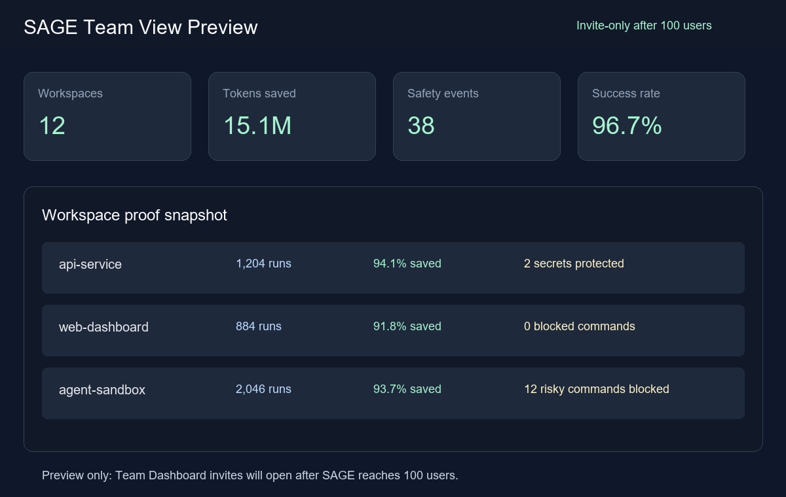
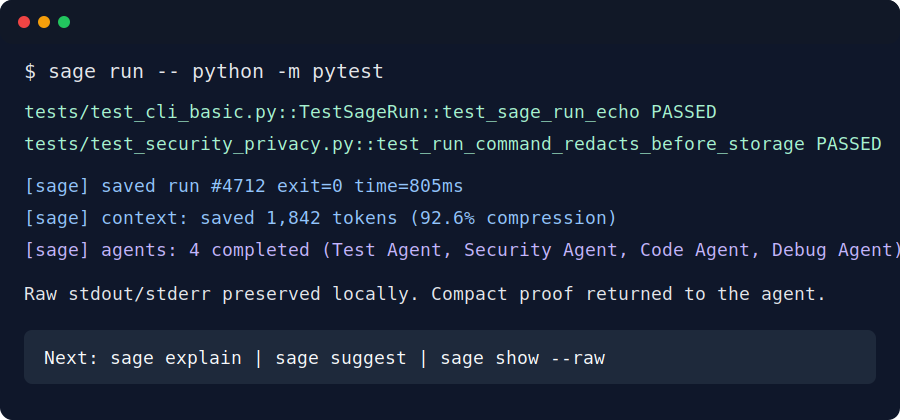
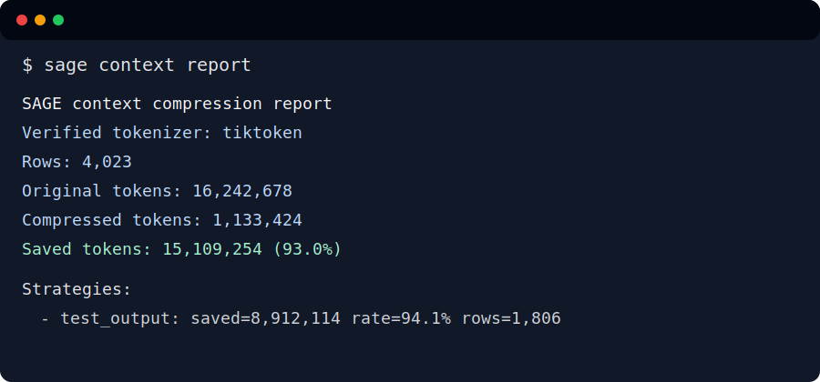
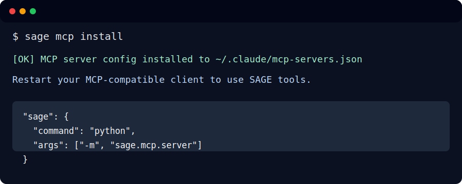

# SAGE

[](https://github.com/PsYcGoD/sage/actions/workflows/ci.yml)
[](pyproject.toml)
[](LICENSE)
[](https://github.com/PsYcGoD/sage/releases)

SAGE is a local-first command wrapper for AI coding agents that compresses terminal output, preserves raw logs locally, and proves token savings with privacy-safe metrics.

Not only that—it uses **10+ specialized AI agents and ML learning** to analyze every command in real-time, detecting security risks, optimizing compression strategies, and continuously improving from your usage patterns. Your terminal becomes smarter with every command you run.

The public package is CLI-first. The desktop GUI is not included in this public repository yet.

## Live Public Proof Dashboard

Live dashboard: https://sage.api.marketingstudios.in/dashboard


Current public proof includes:

- Total commands processed through SAGE
- Tokens processed, compressed, and saved
- Estimated savings by model/provider
- Compression rate and command success rate
- ML prediction scoring from local command history

Latest verified snapshot:

| Metric | Value |
|--------|------:|
| Commands processed | 6,288 |
| Tokens processed | 16,742,284 |
| Tokens compressed | 1,429,155 |
| Tokens saved | 15,314,377 |
| Estimated savings | $45.94 |
| Compression rate | 91.47% |
| Success rate | 99.5% |

These stats reflect live dashboard metrics as of July 7, 2026. Raw commands, outputs, file paths, and logs stay local by default. Public proof uses aggregate counters only.
Raw commands, outputs, file paths, and logs stay local by default. Public proof uses aggregate counters only.

## Install From GitHub Until PyPI Is Live

PyPI publishing is prepared but still blocked by the Trusted Publisher project-name mismatch. Until the PyPI project is live, install the public CLI directly from GitHub:

```bash
pip install git+https://github.com/PsYcGoD/sage.git
sage --version
```

After PyPI is live, the install command will be:

```bash
pip install psycgod-sage
sage --version
```

For local development:

```bash
git clone https://github.com/PsYcGoD/sage.git
cd sage
pip install -e .
sage --version
```

The prepared PyPI distribution is `psycgod-sage`; the installed CLI command is still `sage`.

## Connect Your Account

Most public API-backed commands require GitHub OAuth:

```bash
sage connect
sage whoami
sage api status
```

SAGE stores the API key in the operating system keyring when available. Local command history and raw outputs remain on your machine.

## System-Wide Installation for AI Agents

Make SAGE mandatory for all AI agents on your system:

```bash
sage install
```

This automatically installs SAGE instructions into:
- `~/.claude/CLAUDE.md` - Claude Code
- `~/.claude/settings.json` - MCP server registration
- `~/.cursorrules` - Cursor IDE
- `~/.codex/AGENTS.md` - Codex
- `~/.aider.conf.yml` - Aider (if exists)

After running `sage install`, all AI agents will automatically:
- Route commands through `sage run -- <command>`
- Use SAGE MCP tools for file operations
- Benefit from context compression and tracking

For per-project setup:

```bash
sage init
```

This writes `SAGE.md` in the current project with the mandatory wrapper rule.

## Run Commands Through SAGE

```bash
sage run -- python -m pytest
sage run -- npm test
sage run -- git status
```

SAGE stores full raw command output locally, summarizes noisy output for AI context, tracks compression, and sends only allowed aggregate proof metrics to the dashboard.

## Useful CLI Commands

```bash
sage context stats
sage context report
sage history --limit 10
sage explain
sage suggest
sage fix
sage fix --apply --confidence 0.9
sage savings --agent claude-sonnet
sage firewall status
sage firewall rules list
sage github-bot comment --kind summary
sage mcp install
sage dashboard start --port 8765
```

## Team View Preview

Team Dashboard is not published yet. It will open by invite after SAGE reaches 100 users.



The planned Team View will show aggregate workspace proof only: tokens saved, success rate, safety events, and protected secrets. It will not publish raw commands, source code, file paths, `.env` data, or raw logs.

## Screenshots

| Command | Preview |
|---|---|
| `sage run --` |  |
| `sage context report` |  |
| `sage mcp install` |  |
| Dashboard proof |  |

Starter demo GIFs:

- [`demo-sage-run.gif`](docs/assets/demo-sage-run.gif)
- [`demo-sage-savings.gif`](docs/assets/demo-sage-savings.gif)
- [`demo-github-bot.gif`](docs/assets/demo-github-bot.gif)

## Agents & ML

**AI agents and ML features are fully operational in all SAGE installations** (pip, GitHub clone, or any install method). They run automatically with every command execution.

### Active Agent Types

SAGE includes 10+ specialized agents that analyze every command:
- **Security Agent** - Detects secrets, credentials, and security risks
- **Code Agent** - Checks syntax, scope, and file changes  
- **Debug Agent** - Analyzes errors and suggests fixes
- **Test Agent** - Identifies test patterns and coverage
- **Dependency Agent** - Tracks package installations and versions
- **Research Agent** - Code analysis and pattern detection
- **Frontend Agent** - UI/UX and browser-related analysis
- **Performance Agent** - Performance and optimization insights
- **Workflow Agent** - Multi-step task orchestration
- **Red Team Agent** - Adversarial security testing

### ML Training & Metrics

All installations automatically collect ML training data for improving agent quality:

```bash
# View live statistics
sage dashboard
```

**Example stats from production use:**
- **ML Training Examples:** 8,431+ examples
- **Agent Runs Completed:** 40,275+ runs
- **Agent Quality Metrics:** 48 tracked metrics
- **Agent Tasks Processed:** 42,040+ tasks

The ML system learns from your command patterns to optimize compression strategies and agent responses.

## GUI Status

The desktop GUI is not available in this public repo right now.

```bash
sage gui
```

This command prints the roadmap status instead of launching a desktop app. The GUI will be released later after it is stable enough for public use.

## Known Limitations

- The GUI is not public yet and is intentionally absent from the CLI package.
- GitHub OAuth / a SAGE API key is required for most API-backed commands and public proof sync.
- Telemetry level `0` is local-only; higher levels are opt-in and constrained by account/key policy.
- The public dashboard is aggregate-only and does not expose raw commands, raw outputs, file paths, or local logs.
- ML training and agent quality improve with usage volume - fresh installations have minimal training data initially.

## Privacy

- Raw commands and full outputs stay local by default.
- Public dashboard data is aggregate proof only.
- API connection is handled through GitHub OAuth.
- Higher telemetry is opt-in.
- API keys are stored in the OS keyring when available.

See [PRIVACY.md](PRIVACY.md) and [SECURITY.md](SECURITY.md) for the detailed data and security model.

## Development

```bash
python -m pytest -q
```

The public package is CLI-first. GUI source, GUI tests, and GUI-only dependencies are intentionally not shipped in this repo at this time.
